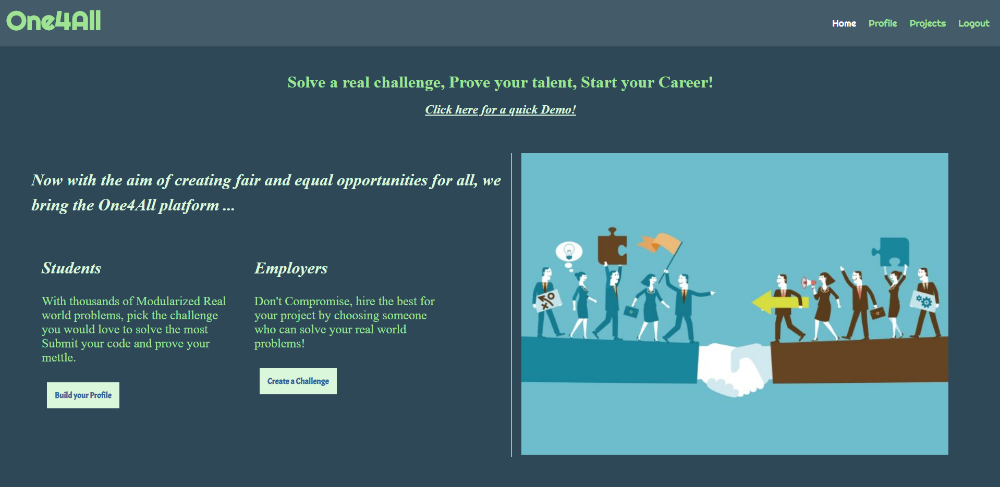
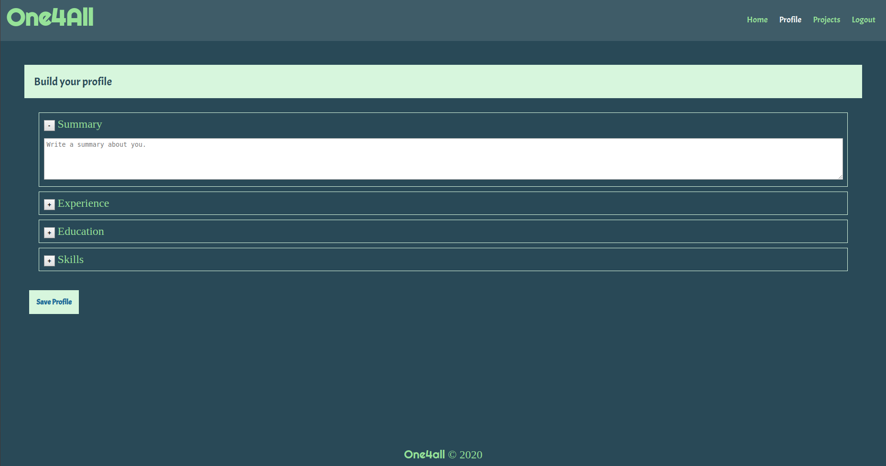
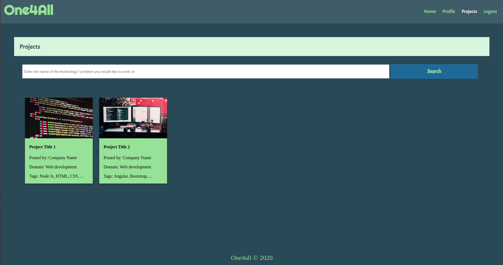
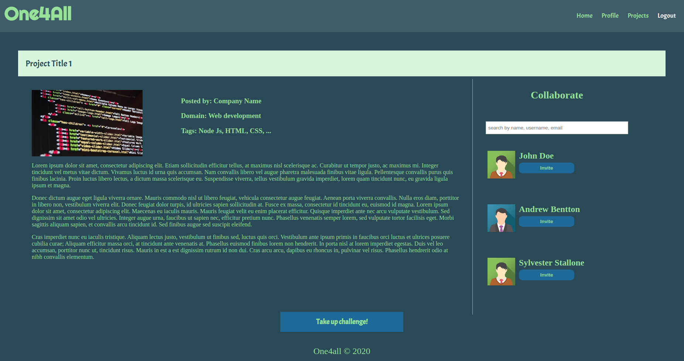
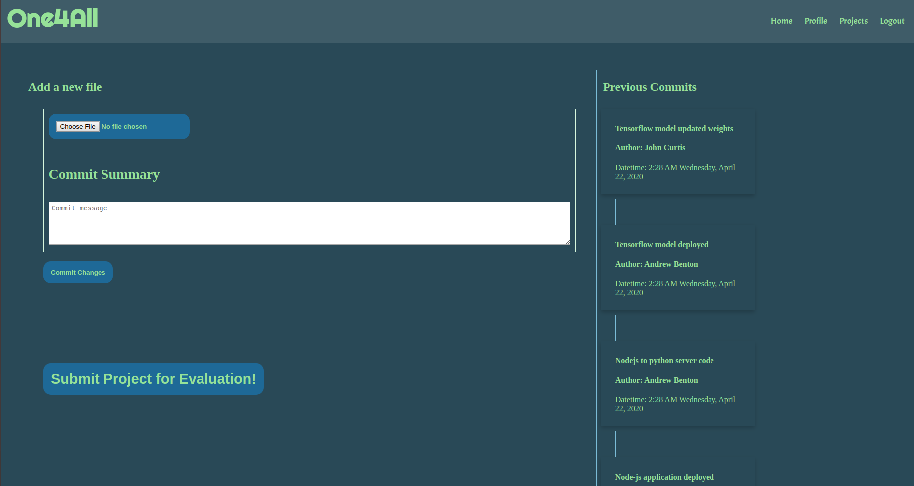
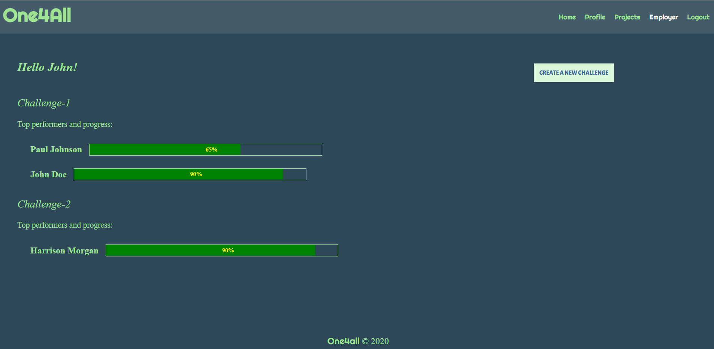
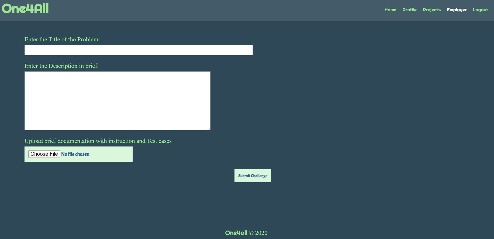
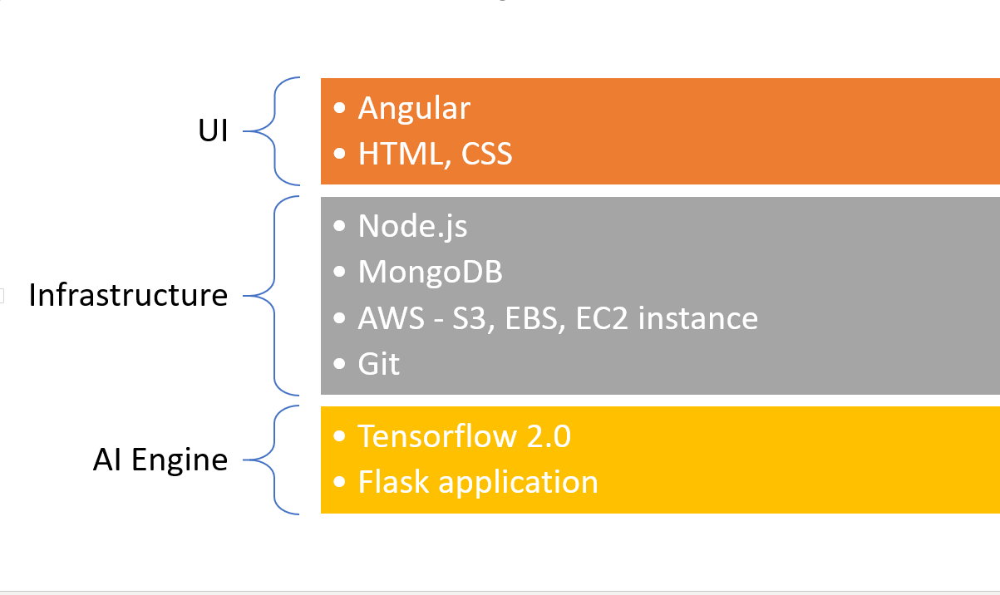
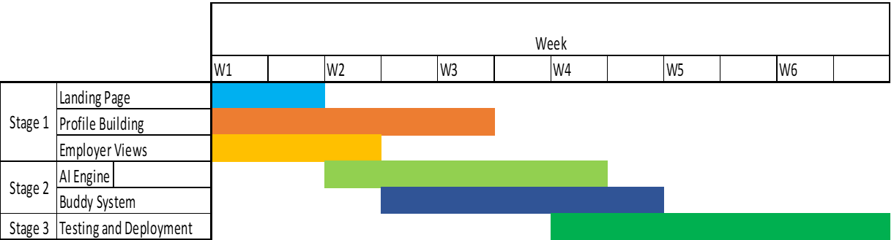

# **One4All**
=========================
## This is quicklink to our demo of how our software works:
https://jstart-app.herokuapp.com/
### Overview

In this proposal, we tend to address the common challenges faced by students undergoing the grinding process of job search. We, including us as we are still students, have all been told that solving coding challenge that involves sorting a string, will help us land a job. We have been pushed into this world of competition of solving problems hours and days together, not knowing what the companies are looking for and the kind resources they want, to finally get a call for the first round from some company that we believe is our dream company. The current system of hiring individuals creates panic and would filter out a lot of talented candidates just based on a time-limited coding challenge.

Here we are building a platform that we call One4All (read as One for All) which will help all the students to move out of the rut that they have been stuck in and work on real-world problems that industries are trying to solve. In this platform, we are looking at a way to provide every user with equal opportunity to solve modularized problems provided by the companies and showcase their skills. While solving these real-world problems the users or students can break the wall and get noticed, for the kind of work they have contributed to, by the companies. The companies, in turn, can review the work of the students and decide on hiring them based on the work showcased. The main advantage in this kind of environment is that students can decide the companies they aim to work with, based on the problems they are trying to solve, and the companies can hire the right candidates by looking at their quality of work.

We believe that building one's skills is as important as finding the right job, and we try to provide the infrastructure to accomplish both of these. We are trying to bridge the gap between what the students know and what companies want.

### Ready to dig deep:

To learn the working of the platform let's jump right into the world of
a student.

Landing page:

### Registration & Profile building:
Here the students can create their profile in multiple ways. They can choose to import their profile from the created resume or build it from scratch. There will be some certain behavioral questions to suggest the challenges and buddies just right for him using AI Engine.

### One4All Challenge search page:

Here the students will be able to search for challenges that they are interested in and start contributing. Our AI Engine will suggest projects/problem statements that align more closely with the user profile.

### Challenge page:

In this page the student will be given a modularized problem chosen
along with the general set of guidelines and policies followed by
companies that hosted the challenge. The challenge will come with a
requirement document that will guide the students further to solve the
problem efficiently and improve their skills. This page will also
provide suitable buddies for each user based on the kind of problem they
are solving and, on the predictions, provided by a behavioral Machine
learning model trained using the answers provided at the profile
building stage. The users can contribute individually or chose to work
along with buddies based on the difficulty level of the project.

For every submission we will commit the code for review, and this will
be tested based on the test suit provided along with the requirement
documentation. The testing will be done using continuous integration
systems like DevOps.

### Repo Page: 

We will maintain a repository for each user registered to help and
maintain his contributions.

To learn the working of the platform from company's perspective let's
jump right into the world of an employer.

### Landing page

This page will show the Employer the existing challenges created by them
if any. Each challenge will list out the top set of students and their
respective progress on the project.

It also consists of a detailed report to show who all have attempted the
challenge. If the employer likes a performance, he can reach out to the
student by looking at his profile.

### Challenge creation page

This page will provide a form where the Employer is required to put his
Problem statement along with the requirement document which will be
modularized by the AI Engine.

### Technology Stack

### Timeline of Execution within the 6 week time frame:

### Conclusion:

*Our Impact*: We aim to provide employment to millions of talented
people

*Our Creativity*: We challenge the status quo. We have come up with an
idea of creating something that does not exist with the existing
technologies

*Project Feasibility:* We have come up with a solution that we can
confidently say that, it will be completed within 6week duration of the
fellowship by delivering a fully functioning platform

*Leveling the playing field*: With this particular platform, not just
students but everyone can take up challenges with respect to their
experience. This platform creates a equal opportunity for each
individual. By the end of day, a Job in hand would mean so much
especially during these times and talent should not go wasted. With this
platform we aim to create opportunities for each Individual.
